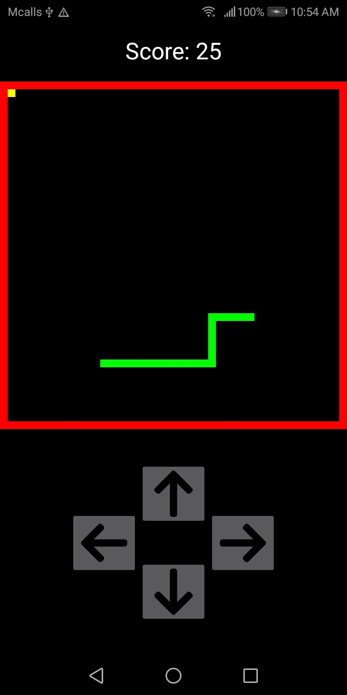

# snake-android
It is a 2D board mobile game which the snake eats the food to grow itself while trying to avoid hitting obstacles.

  

## Table of Contents
- [Prerequisites](https://github.com/ii887522/snake-android#prerequisites)

## Prerequisites
- [Visual Studio Code](https://code.visualstudio.com/)
  - EditorConfig for VS Code
  - Markdown All in One
  - YAML
- [Android Studio 4.1.2](https://developer.android.com/studio) and later
